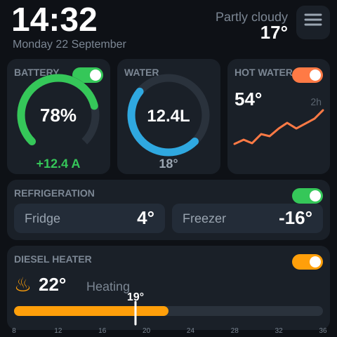
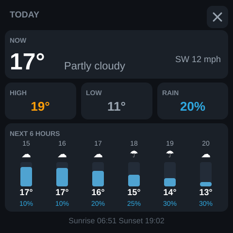
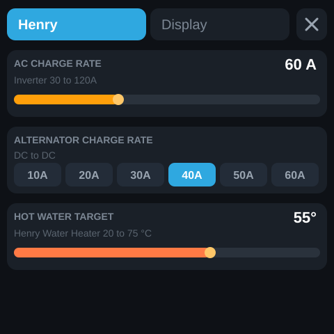
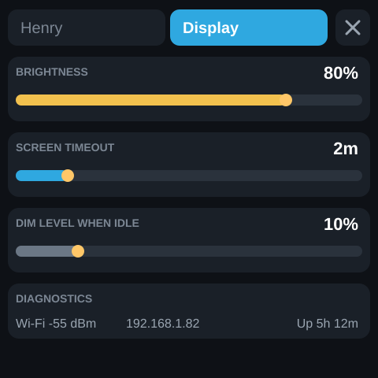
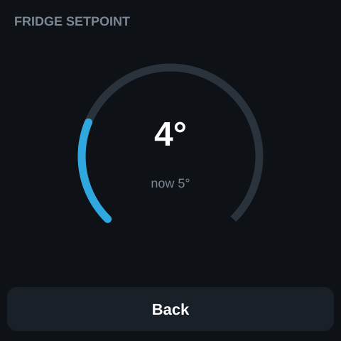
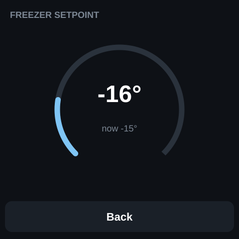
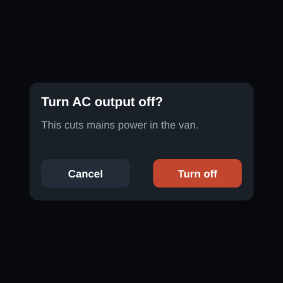

# Henry Display

ESPHome/LVGL touchscreen controller for **Henry**, a camper/van control display built around an ESP32-S3 and a 480 × 480 touch panel.

The display is primarily a Home Assistant front end: it presents battery, water, refrigeration, hot-water, weather and diesel-heater information, while also exposing the controls that are useful from the van.

> The screenshots below are reference mockups using illustrative values. The layout and labels mirror the firmware; live values come from Home Assistant.

## Screens

| Main dashboard | Weather forecast |
| --- | --- |
|  |  |

| Henry controls | Display settings |
| --- | --- |
|  |  |

| Fridge setpoint | Freezer setpoint |
| --- | --- |
|  |  |

### Main dashboard

The home page is designed for a quick glance while living or travelling in the van.

- **Battery** — state of charge, live shunt current and the inverter/AC-output switch.
- **Water** — the centre value is the actual reading from `sensor.henry_henry_water_meter_water_since_reset` in litres. The blue ring represents estimated tank remaining capacity: **0 L used = full blue**, **35 L or more = fully grey/empty**. The blue portion drains anti-clockwise and clamps at empty. Long-pressing the WATER card calls `button.press` on `button.henry_henry_water_meter_reset_water_since_reset` to reset the since-reset counter. The water-temperature reading below it is unchanged and comes from the separate temperature sensor.
- **Hot water** — tank temperature, element control, and a locally sampled two-hour temperature trace. ESPHome cannot read Home Assistant history directly, so the graph starts again after a display reboot.
- **Refrigeration** — fridge/freezer current temperatures, refrigeration power, and links to the two setpoint pages.
- **Diesel heater** — the large temperature is the climate target. The small marker on the slider is the live ambient temperature from `sensor.sunster_diesel_heater_ambient_temperature`. The switch controls the heater HVAC mode.
- **Weather** — current condition and outdoor temperature; tapping either opens the forecast page.

### Forecast

The forecast page shows current temperature/condition/wind, today's high/low/rain probability and six hourly columns. It expects the Home Assistant helper `sensor.henry_forecast_today` to expose the attributes used by the firmware:

`temp_high`, `temp_low`, `rain_pct`, `hours`, `temps`, `rains`, `conds`, `wind`, `sunrise`, and `sunset`.

### Henry controls

The Henry settings page exposes the operational settings most useful in the van:

- AC charge current, 30–120 A.
- Alternator/DC-to-DC maximum charging current, 10–60 A.
- Hot-water target temperature, 20–75 °C.

### Display settings

Local display configuration is persisted on the ESP32:

- Brightness.
- Idle timeout in 30-second steps, including **Never**.
- Dim level while idle.
- Wi-Fi RSSI, IP address and uptime diagnostics.

When dimmed, LVGL is paused. The first touch wakes the panel rather than activating a control underneath the user's finger.

### Fridge and freezer setpoints

Each refrigeration zone has a dedicated touch arc for its target temperature and shows the corresponding current temperature. Changes are sent to Home Assistant when the control is released.

### AC-output confirmation

Turning the inverter/AC output **off** requires confirmation because it cuts mains power in the van.



## Hardware configured by the firmware

- ESP32-S3 DevKitC-1
- 16 MB flash
- Octal PSRAM at 80 MHz
- ESP-IDF framework
- ST7701S 480 × 480 RGB display
- GT911 touch controller
- PWM backlight on GPIO38

The complete display timing, RGB data pins, SPI pins and I²C pins are defined in `henry-display.yaml`.

## Home Assistant entities

| Purpose | Entity |
| --- | --- |
| Battery current | `sensor.renogy_shunt300_renogy_shunt_current` |
| Battery state of charge | `sensor.renogy_shunt300_renogy_shunt_state_of_charge` |
| Inverter/AC output | `switch.henry_bt_th_a58a7b70_output` |
| AC charge current | `number.henry_bt_th_a58a7b70_charge_current` |
| Water used since reset | `sensor.henry_henry_water_meter_water_since_reset` |
| Reset water since reset | `button.henry_henry_water_meter_reset_water_since_reset` |
| Water temperature | `sensor.pro_check_universal_a0f2_temperature` |
| Hot-water tank temperature | `sensor.henry_water_heater_tank_temperature` |
| Hot-water target | `number.henry_water_heater_tank_temperature_target` |
| Hot-water element | `switch.henry_henry_water_heater_element_switch` |
| Fridge power | `switch.henry_amps_fridge_amps_fridge_power` |
| Fridge climate | `climate.amps_fridge_fridge` |
| Freezer climate | `climate.amps_fridge_freezer` |
| Diesel-heater climate | `climate.sunster_diesel_heater_heater` |
| Diesel-heater ambient temperature | `sensor.sunster_diesel_heater_ambient_temperature` |
| Current weather | `weather.pirateweather` |
| Forecast helper | `sensor.henry_forecast_today` |
| Alternator max charge current | `select.henry_renogy_dcc_renogy_max_charging_current` |

## Water gauge behaviour

The water meter is treated as a **since-reset usage counter for a roughly 35 L tank**, rather than as a direct level sensor. Long-press the WATER card to reset the counter after refilling the tank.

| Meter total | Ring |
| ---: | --- |
| 0 L | Full |
| 8.75 L | 75% remaining |
| 17.5 L | 50% remaining |
| 26.25 L | 25% remaining |
| 35 L or more | Empty |

The centre of the gauge always shows the actual since-reset total, even above 35 L; only the ring is clamped. The active blue arc represents water remaining, so it shrinks to reveal the grey track as water is used. Long-pressing the WATER card resets the Home Assistant since-reset counter to 0 after a refill.

## Building and flashing

This is a normal ESPHome configuration. Create a local `secrets.yaml` containing the Wi-Fi values referenced by the firmware:

```yaml
henryvan_wifi_ssid: "your-ssid"
wifi_password: "your-password"
```

Then validate or flash with ESPHome, for example:

```bash
esphome config henry-display.yaml
esphome run henry-display.yaml
```

The build machine needs network access because the configuration fetches Roboto and the Material Design Icons font at build time.

## Repository layout

```text
henry-display.yaml       ESPHome firmware
README.md                Project and UI reference
docs/screens/            Reference mockups for each LVGL screen/state
```

## Notes

- The display's clock comes from Home Assistant and uses `Europe/London`.
- OTA updates turn the backlight off before flashing.
- A fallback Wi-Fi access point is configured.
- The hot-water trace stores 60 samples at two-minute intervals, giving a two-hour local graph window.
